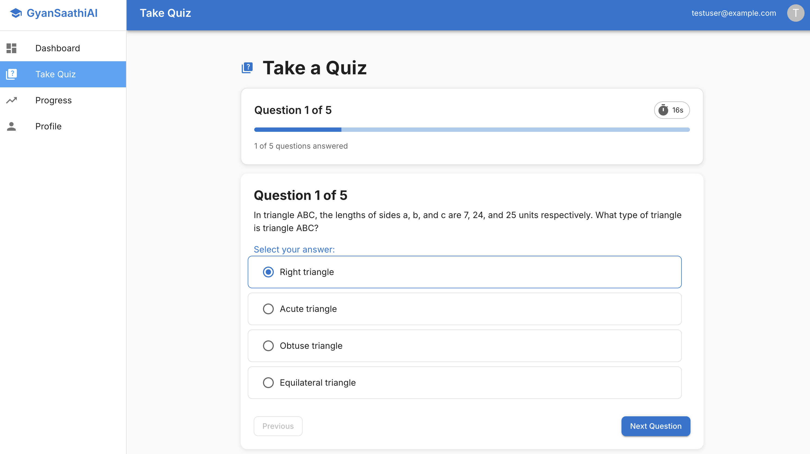
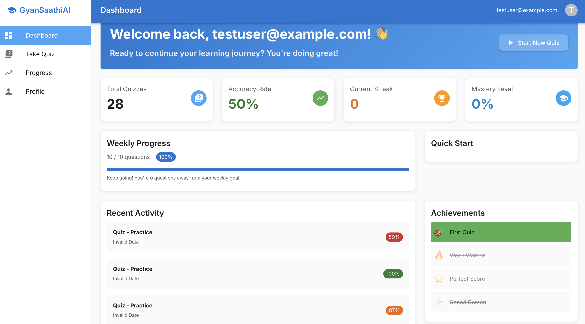

# GyanSaathiAI

AI-powered tutoring platform with subject/topic-specific quizzes, agent-driven question generation, and an Airflow pipeline for batch generation. Services: React (Frontend), Node.js + GraphQL (Backend), Python LangChain/LangGraph (Agent), PostgreSQL, MongoDB, Redis, Airflow. All containerized via Docker Compose.

## 🏗️ System Architecture

### High-Level Architecture
```
┌─────────────────┐    ┌─────────────────┐    ┌─────────────────┐
│   Frontend      │    │    Backend      │    │   Agent         │
│   (React)       │◄──►│   (Node.js)     │    │   (Python)      │
│   Port: 3000    │    │   Port: 5000    │    │   Port: 8000    │
└─────────────────┘    └─────────────────┘    └─────────────────┘
         │                       │                       │
         ▼                       ▼                       ▼
┌─────────────────┐    ┌─────────────────┐    ┌─────────────────┐
│   Nginx         │    │   PostgreSQL    │    │   MongoDB       │
│   (Proxy)       │    │   (Main DB)     │    │   (Questions)   │
│   Port: 80      │    │   Port: 5432    │    │   Port: 27017   │
└─────────────────┘    └─────────────────┘    └─────────────────┘
```


### Data Flow Architecture

#### **1. Content Ingestion Flow (Admin)**
```
Agent Service → Ingest Endpoint → RAG Vector Database (PostgreSQL + pgvector)
     │
     ├── /ingestSampleCorpus (populates sample data)
     ├── /ingestEmbedding (adds custom documents)
     └── Creates embeddings using OpenAI text-embedding-3-small
```

#### **2. Question Generation Flow (Admin)**
```
Agent Service → Generate Question → RAG Retrieval → LLM Processing → MongoDB Storage
     │
     ├── /admin/generate/question
     ├── RAG finds relevant content chunks
     ├── LLM (GPT-4) generates question
     ├── Validation pipeline runs
     └── Question saved to MongoDB questions collection
```

#### **3. Student Access Flow**
```
Student Frontend → Nginx → Backend API → Database Queries
     │
     ├── Login: PostgreSQL users table + Redis cache
     ├── Fetch Questions: MongoDB questions collection
     ├── Save Progress: PostgreSQL progress tables
     └── Quiz Attempts: PostgreSQL quiz_attempts table
```

### **Detailed Component Interactions**

```
┌─────────────────────────────────────────────────────────────────────────────┐
│                              STUDENT FLOW                                  │
├─────────────────────────────────────────────────────────────────────────────┤
│ Frontend → Nginx:80 → Backend:5000 → PostgreSQL (users, progress)        │
│                    → MongoDB (questions)                                  │
│                    → Redis (user cache, sessions)                         │
└─────────────────────────────────────────────────────────────────────────────┘

┌─────────────────────────────────────────────────────────────────────────────┐
│                              ADMIN FLOW                                    │
├─────────────────────────────────────────────────────────────────────────────┤
│ Agent:8000 → RAG Vector Store (PostgreSQL + pgvector)                     │
│           → OpenAI Embeddings (text-embedding-3-small)                    │
│           → LLM Processing (GPT-4)                                        │
│           → MongoDB (questions collection)                                │
└─────────────────────────────────────────────────────────────────────────────┘

┌─────────────────────────────────────────────────────────────────────────────┐
│                              DATA STORES                                   │
├─────────────────────────────────────────────────────────────────────────────┤
│ PostgreSQL: users, quiz_attempts, progress_summary, corpus_documents      │
│ MongoDB: questions (versioned, immutable)                                 │
│ Redis: user sessions, progress cache, rate limiting                       │
│ pgvector: document embeddings for semantic search                         │
└─────────────────────────────────────────────────────────────────────────────┘
```

## 🚀 Quick Start

### Prerequisites
- Docker Desktop installed and running
- 8GB+ RAM recommended
- Ports 80, 5000, 8000 available

### Build and Run
```bash
# Clone and navigate to the repository
cd Ai-Tutor

# update API KEYS
update OPENAI_API_KEY in .env file

# Start all services
docker-compose up -d

# Check health of all services
curl http://localhost:5000/api/v1/health          # Backend health
curl http://localhost:8000/health                  # Agent health
curl http://localhost                             # Frontend (via nginx)
```

Airflow UI: http://localhost:8080 (airflow/airflow)

### Access Points
- **Frontend**: http://localhost (via nginx)
- **Backend API**: http://localhost:5000/api
- **Agent API**: http://localhost:8000
- **Health Check**: http://localhost:5000/api/v1/health

## 📋 Features

### 🎓 Educational Features
- **Adaptive Quiz Generation**: AI-powered questions based on subject, topic, and difficulty
- **Multi-subject Support**: Math, Science, History, English and extensible to other subjects

### 🔧 Technical Features
- **Microservices Architecture**: Separate services for scalability
- **RAG-Powered Content**: Retrieval-augmented generation for grounded questions
- **LangGraph Workflows**: Sophisticated AI pipelines with validation
- **JWT Authentication**: Secure user management with RBAC
- **Vector Search**: pgvector for semantic content retrieval

## 🎯 API Documentation

### Agent Service (Question Generation)
```bash
# Ingest sample corpus
curl -X POST "http://localhost:8000/ingestSampleCorpus"

# Generate question
curl -X POST "http://localhost:8000/admin/generate/question" \
  -H "Content-Type: application/json" \
  -d '{
    "subject": "math",
    "topic": "linear equations",
    "class_level": "8",
    "difficulty": "medium",
    "question_type": "multiple_choice"
  }'

# Ingest custom document
curl -X POST "http://localhost:8000/ingestEmbedding" \
  -H "Content-Type: application/json" \
  -d '{
    "content": "Your document content here...",
    "metadata": {
      "subject": "math",
      "class": "9",
      "chapter": "Algebra"
    }
  }'
```

### Backend Service (Student Management)
```bash
# Student Registration
curl -X POST "http://localhost:5000/api/auth/register" \
  -H "Content-Type: application/json" \
  -d '{
    "username": "student1",
    "email": "student@example.com",
    "password": "password123",
    "firstName": "John",
    "lastName": "Doe",
    "gradeLevel": 8,
    "preferredSubjects": ["math", "science"]
  }'

# Student Login
curl -X POST "http://localhost:5000/api/v1/auth/login" \
  -H "Content-Type: application/json" \
  -d '{
    "email": "student@example.com",
    "password": "password123"
  }'

# Fetch Questions
curl -X GET "http://localhost:5000/api/v1/questions/generate?subject=math&topic=algebra&limit=5" \
  -H "Authorization: Bearer <token>"
```

## 🗄️ Database Schema

### PostgreSQL (Main Database)
- **users**: User accounts, profiles, and authentication
- **user_preferences**: Student subject preferences and settings
- **quiz_attempts**: Quiz session metadata and progress
- **attempt_items**: Individual question responses with immutable snapshots
- **progress_summary**: Precomputed progress by user/subject/skill
- **langchain_pg_collection**: RAG collection metadata
- **langchain_pg_embedding**: Document embeddings for vector search

### MongoDB (Question Storage)
- **questions**: Versioned question content (immutable once active)
- **Structure**: questionText, options, correctAnswer, explanation, metadata

### Redis (Caching & Sessions)
- **user sessions**: Authentication tokens and user data
- **progress cache**: Fast access to user progress
- **rate limiting**: API request throttling

## 🔬 Testing the System

### 1. Setup Corpus and Generate Questions
```bash
# 1. Ingest sample corpus
curl -X POST "http://localhost:8000/ingestSampleCorpus"

# 2. Generate a question
curl -X POST "http://localhost:8000/admin/generate/question" \
  -H "Content-Type: application/json" \
  -d '{"subject": "math", "topic": "linear equations", "class_level": "8"}'
```

### 2. Create Student Account
```bash
# Register student
curl -X POST "http://localhost:5000/api/auth/register" \
  -H "Content-Type: application/json" \
  -d '{"username": "test_student", "email": "test@example.com", "password": "password123", "firstName": "Test", "lastName": "Student", "gradeLevel": 8, "preferredSubjects": ["math"]}'
```

### 3. Test Student Login and Question Access
```bash
# Login and get token
TOKEN=$(curl -s -X POST "http://localhost:5000/api/v1/auth/login" \
  -H "Content-Type: application/json" \
  -d '{"email": "test@example.com", "password": "password123"}' | jq -r '.data.token')

# Fetch questions
curl -X GET "http://localhost:5000/api/v1/questions/generate?subject=math&topic=algebra&limit=3" \
  -H "Authorization: Bearer $TOKEN"
```

## 🛠️ Development

### Project Structure
```
Ai-Tutor/
├── backend/           # Node.js API server (Student management)
│   ├── src/
│   │   ├── routes/v1/ # V1 API endpoints
│   │   ├── models/    # Data models
│   │   └── services/  # Business logic
│   └── migrations/    # Database schema
├── frontend/          # React application (Student interface)
│   └── src/
├── agent/             # Python LangChain service (AI generation)
│   ├── src/
│   │   ├── services/  # RAG, question generation
│   │   └── models/    # Pydantic schemas
│   └── data/          # Sample corpus data
├── ops/               # Container configuration
│   ├── nginx/         # Reverse proxy config
│   └── supervisor/    # Process management
└── docker-compose.yml # Service orchestration
```

## 🖼️ Screenshots

Place screenshots under `docs/screenshots/` and they will render below. Suggested filenames are already referenced; just add the PNGs.

### Take a Quiz


### Dashboard


### Key Data Flows Implemented

✅ **Content Ingestion**: Agent → RAG Vector Database (PostgreSQL + pgvector)  
✅ **Question Generation**: Agent → RAG Retrieval → LLM → MongoDB  
✅ **Student Access**: Frontend → Nginx → Backend → PostgreSQL/MongoDB/Redis  
✅ **Authentication**: JWT tokens with Redis caching  
✅ **RAG Integration**: Semantic search with OpenAI embeddings  
✅ **AI Pipeline**: LangGraph workflow with validation  

## 🔍 Monitoring

### **Health Checks**
```bash
# Backend health
curl http://localhost:5000/api/v1/health

# Agent health  
curl http://localhost:8000/health

# Frontend (via nginx)
curl http://localhost
```

### **Service Status**
```bash
# Check all services
docker-compose ps

# View logs
docker-compose logs -f

# Check specific service
docker-compose logs agent
```

## 🚢 Production Considerations

For production deployment:

1. **Environment Variables**: Set secure JWT secrets, OpenAI API keys
2. **Data Persistence**: Mount volumes for database data
3. **Scaling**: Scale individual services independently
4. **Security**: Enable TLS, update dependencies, network policies
5. **Monitoring**: Add external observability stack

```bash
# Production with data persistence
docker-compose -f docker-compose.yml -f docker-compose.prod.yml up -d
```

## 📝 License

This project is for demonstration purposes. Individual components may have different licenses.
